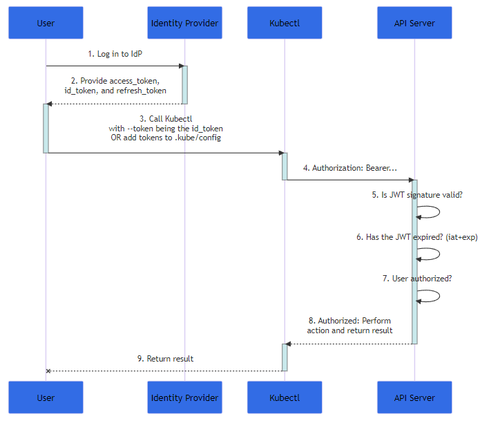

### Static token file
kube-apiserver는 `--token-auth-file` flag에 명시된 파일에서 bearer token을 읽는다. token은 무한정 지속되며 token 목록은 kube-apiserver를 재시작하지 않는 이상 변경할 수 없다.

token 파일은 최소 3개의 컬럼을 갖는 csv 파일이다. 컬럼은 다음과 같다: token, user name, user uid, (optional)group name

> **Note**:  
> 1개 이상의 그룹을 갖는 경우 dobule quoting이 필요하다. 아래는 예시다.
> ```
> token,user,uid,"group1,group2,group3"
> ```


## External integrations
k8s는 JWT 및 OpenID Connect(OIDC)를 기본 지원한다. 자세한 내용은 아래 JSON Web Token authentication을 참고한다.

다른 인증 프로토콜(LDAP, SAML, Kerberos, 대체 X.509 방식 등)과의 통합은 authenticating proxy 또는 authentication webhook을 사용해 수행할 수 있다.

클라이언트에 X.509 인증서를 발급하는 사용자 정의 방법을 사용할 수도 있으며, kube-apiserver가 유효한 인증서를 신뢰하는 경우에 한한다. X.509 클라이언트 인증서 생성 방법은 위 X.509 client certificates를 참고한다.

### JSON Web Token authentication
k8s는 [JSON Web Token](https://www.rfc-editor.org/rfc/rfc7519)(JWT) 호환 token을 사용해 사용자를 인증하도록 설정할 수 있다. JWT authentication 메커니즘은 k8s 자체적으로 발급하는 ServiceAccount token에 사용되며, 다른 ID 소스와의 통합에도 사용할 수 있다.

authenticator는 raw ID token을 파싱하고 설정된 issuer가 서명했는지 검증을 시도한다. 외부에서 발행된 token의 경우 서명을 검증하기 위한 공개 키는 OIDC discovery를 사용해 issuer의 공개 endpoint에서 가져온다.

최소한의 유효한 JWT 페이로드는 다음 claim을 포함해야 한다.
``` json
{
  "iss": "https://example.com",   // issuer.url과 일치해야 함
  "aud": ["my-app"],              // issuer.audiences의 항목 중 하나 이상이 JWT의 "aud" claim과 일치해야 함
  "exp": 1234567890,              // Unix 시간으로 표현된 token 만료 시간 (1970년 1월 1일 UTC 이후 경과 초)
  "<username-claim>": "user"      // claimMappings.username.claim 또는 claimMappings.username.expression에 설정된 사용자 이름 claim
}
```

#### JWT egress selector type
FEATURE STATE: `Kubernetes v1.34 [beta]` (기본 활성화)

JWT issuer 설정의 `egressSelectorType` 필드를 사용하면 issuer와 관련된 모든 트래픽(discovery, JWKS, distributed claims 등)을 전송할 때 사용할 egress selector를 지정할 수 있다. 이 기능을 사용하려면 `StructuredAuthenticationConfigurationEgressSelector` feature gate가 활성화되어야 한다.

#### OpenID Connect tokens
OpenID Connect는 Microsoft Entra ID, Salesforce, Google와 같은 OAuth2 provider에서 지원하는 프로토콜이다. 이 프로토콜의 주요 기능은 access token과 같이 반환되는 추가 필드인 [ID Token](https://openid.net/specs/openid-connect-core-1_0.html#IDToken)이다. 이 token은 서버에 의해 서명된 JWT다.

사용자를 식별하기 위해 authenticator는 OAuth2 [token response](https://openid.net/specs/openid-connect-core-1_0.html#TokenResponse)의 `id_token`을 bearer token으로 사용한다. 아래는 ID Token을 통한 요청 예시다.


1. identity provider에 로그인한다.
2. identity provider는 `access_token`, `id_token`, `refresh_token`을 응답한다.
3. kubectl을 사용하는 경우 kubeconfig 또는 `--token` flag에 `id_token`을 사용한다.
4. kubectl은 kube-apiserver에 authentication하기 위해 HTTP Authorization header에 `id_token`을 사용한다.
5. kube-apiserver는 JWT 서명이 유효한지 확인한다.
6. `id_token`이 만료되지 않았는지 확인한다.
    - 만약 CEL 표현식이 AuthenticationConfiguration과 함께 설정됐다면 claim 및/또는 사용자 유효성 검사를 수행한다.
7. 사용자에 대한 authorization을 수행한다.
8. authorization 이후 kube-apiserver는 kubectl에 응답한다.
9. kubectl이 사용자에게 결과를 응답한다.

사용자를 인증하기 위한 모든 데이터가 `id_token`에 포함되기 때문에 k8s는 identity provider에 확인할 필요가 없다. 이와 같은 모델에서 모든 요청은 stateless하기 때문에 authentication을 위한 매우 확장성이 높은 솔루션을 제공하지만 몇 가지 과제가 있다.
1. k8s는 authentication 프로세스를 트리거하기 위한 "web interface"가 없다. k8s는 credential을 수집하기 위한 브라우저, interface가 없기 때문에 사용자는 먼저 identity provider에 직접 인증해야 한다.
2. `id_token`을 취소(revoke)할 수 없으며 인증서처럼 짧은 시간 동안(몇 분)만 유효해야 한다. 따라서 몇 분마다 새로운 token을 발급해야 하기 때문에 매우 번거롭다.
3. k8s 대시보드에 인증하기 위해 kubectl proxy 명령이나 `id_token`을 주입하는 reverse proxy를 사용해야 한다.

#### Configuring the API Server

##### Using command line arguments
kube-apiserver에서 플러그인을 활성화하려면 다음 커맨드 라인 인자를 설정한다.

| 파라미터 | 설명 | 예시 | 필수 |
|---|---|---|---|
| `--oidc-issuer-url` | API 서버가 공개 서명 키를 검색할 수 있는 provider의 URL. `https://` 스킴만 허용됨. 일반적으로 provider의 discovery URL에서 빈 경로를 갖도록 변경한 것. | issuer의 OIDC discovery URL이 `https://accounts.provider.example/.well-known/openid-configuration`이면 값은 `https://accounts.provider.example` | 예 |
| `--oidc-client-id` | 모든 token이 발급되어야 하는 클라이언트 ID | `kubernetes` | 예 |
| `--oidc-username-claim` | 사용자 이름으로 사용할 JWT claim. 기본 값은 `sub`이며 최종 사용자의 고유 식별자로 예상됨. 관리자는 provider에 따라 `email`, `name` 등 다른 claim을 선택할 수 있다. 단 `email` 외의 claim은 다른 플러그인과의 충돌을 방지하기 위해 issuer URL이 prefix로 추가됨 | `sub` | 아니오 |
| `--oidc-username-prefix` | 기존 이름(예: `system:` 사용자)과의 충돌을 방지하기 위해 사용자 이름 claim에 추가되는 prefix. 예를 들어 `oidc:` 값은 `oidc:jane.doe`와 같은 사용자 이름을 생성. 이 인자가 제공되지 않고 `--oidc-username-claim`이 `email` 이외의 값이면 기본 prefix는 `(Issuer URL)#`. 모든 접두사를 비활성화하려면 `-` 값 사용 | `oidc:` | 아니오 |
| `--oidc-groups-claim` | 사용자 그룹으로 사용할 JWT claim. 해당 claim이 있으면 문자열 배열이어야 함 | `groups` | 아니오 |
| `--oidc-groups-prefix` | 기존 이름(예: `system:` 그룹)과의 충돌을 방지하기 위해 그룹 claim에 추가되는 prefix. 예를 들어 `oidc:` 값은 `oidc:engineering`, `oidc:infra`와 같은 그룹 이름을 생성 | `oidc:` | 아니오 |
| `--oidc-required-claim` | ID Token에 필요한 claim을 설명하는 key=value 쌍. 설정하면 해당 claim이 일치하는 값으로 ID Token에 있는지 검증됨. 여러 claim을 지정하려면 이 인자를 반복 사용 | `claim=value` | 아니오 |
| `--oidc-ca-file` | identity provider의 웹 인증서에 서명한 CA의 인증서 경로. 기본 값은 호스트의 root CA | `/etc/kubernetes/ssl/kc-ca.pem` | 아니오 |
| `--oidc-signing-algs` | 허용되는 서명 알고리즘. 기본 값은 RS256. 허용 값: RS256, RS384, RS512, ES256, ES384, ES512, PS256, PS384, PS512 (RFC 7518 정의) | `RS512` | 아니오 |

##### Authentication configuration from a file
FEATURE STATE: `Kubernetes v1.34 [stable]` (기본 활성화)

설정 파일 방식을 사용하면 각각 고유한 `issuer.url`과 `issuer.discoveryURL`을 가진 여러 JWT authenticator를 설정할 수 있다. 설정 파일에서는 [CEL](https://kubernetes.io/docs/reference/using-api/cel/) 표현식을 사용해 claim을 사용자 속성에 매핑하고 claim 및 사용자 정보를 검증할 수도 있다. kube-apiserver는 설정 파일이 수정되면 authenticator를 자동으로 다시 로드한다. `apiserver_authentication_config_controller_automatic_reload_last_timestamp_seconds` 메트릭으로 마지막 리로드 시간을 모니터링할 수 있다.

kube-apiserver에 `--authentication-config` 커맨드 라인 인자를 사용해 authentication 설정 파일의 경로를 지정해야 한다. 커맨드 라인 인자를 대신 사용하고 싶다면 그대로 사용할 수 있다. 여러 authenticator 설정, issuer에 대한 여러 audience 설정 등 새로운 기능에 접근하려면 설정 파일로 전환해야 한다.

> **Note**:
> `--authentication-config`와 `--oidc-*` 커맨드 라인 인자를 함께 지정하면 잘못된 설정이다. 이 경우 kube-apiserver는 오류를 보고하고 즉시 종료된다. structured authentication configuration을 사용하려면 `--oidc-*` 커맨드 라인 인자를 제거하고 설정 파일을 사용해야 한다.

아래는 structured authentication configuration 파일 예시다.
``` yaml
---
#
# CAUTION: this is an example configuration.
#          Do not use this for your own cluster!
#
apiVersion: apiserver.config.k8s.io/v1
kind: AuthenticationConfiguration
# JWT 호환 token을 사용해 k8s 사용자를 인증하기 위한 authenticator 목록
# 최대 허용 authenticator 수는 64개
jwt:
- issuer:
    # url은 모든 authenticator에서 고유해야 함
    # url은 --service-account-issuer에 설정된 issuer와 충돌하면 안 됨
    url: https://example.com # --oidc-issuer-url과 동일
    # discoveryURL이 지정되면 "{url}/.well-known/openid-configuration" 대신
    # discovery 정보를 가져오는 데 사용되는 URL을 재정의
    # 필요한 경우 "/.well-known/openid-configuration"을 discoveryURL에 포함해야 함
    # 가져온 discovery 정보의 "issuer" 필드는 AuthenticationConfiguration의 "issuer.url" 필드와
    # 일치해야 하며 JWT의 "iss" claim을 검증하는 데 사용됨
    # issuer와 다른 위치(예: cluster 내 로컬)에서 well-known 및 jwks endpoint를 호스팅하는 시나리오를 위한 것
    # discoveryURL은 지정 시 url과 달라야 하며 모든 authenticator에서 고유해야 함
    discoveryURL: https://discovery.example.com/.well-known/openid-configuration
    # discovery 정보를 가져올 때 연결을 검증하는 데 사용되는 PEM 인코딩 CA 인증서
    # 설정하지 않으면 시스템 verifier가 사용됨
    # --oidc-ca-file 커맨드 라인 인자가 참조하는 파일의 내용과 동일
    certificateAuthority: <PEM encoded CA certificates>    
    # JWT가 발행되어야 하는 허용 가능한 audience 집합
    # 항목 중 하나 이상이 JWT의 "aud" claim과 일치해야 함
    audiences:
    - my-app # --oidc-client-id와 동일
    - my-other-app
    # 여러 audience가 지정된 경우 "MatchAny"로 설정해야 함
    audienceMatchPolicy: MatchAny
    # issuer와 관련된 모든 트래픽(discovery, JWKS, distributed claims 등)에
    # 사용할 egress selector를 나타내는 표시기. 지정하지 않으면 커스텀 dialer가 사용되지 않음
    # StructuredAuthenticationConfigurationEgressSelector feature gate가 활성화되어야 함
    # 유효한 값: "controlplane" (control plane으로 가는 트래픽), "cluster" (k8s가 관리하는 시스템으로 가는 트래픽)
    egressSelectorType: <egress-selector-type>
  # token claim을 검증해 사용자를 인증하는 규칙
  claimValidationRules:
    # --oidc-required-claim key=value와 동일
  - claim: hd
    requiredValue: example.com
    # claim과 requiredValue 대신 expression을 사용해 claim을 검증할 수 있음
    # expression은 boolean으로 평가되는 CEL 표현식
    # 모든 expression이 true로 평가되어야 검증 성공
  - expression: 'claims.hd == "example.com"'
    # 검증 실패 시 kube-apiserver 로그에 표시되는 오류 메시지를 커스터마이즈
    message: the hd claim must be set to example.com
  - expression: 'claims.exp - claims.nbf <= 86400'
    message: total token lifetime must not exceed 24 hours
  claimMappings:
    # username은 사용자 이름 속성에 대한 옵션. 유일한 필수 속성
    username:
      # --oidc-username-claim과 동일. username.expression과 상호 배타적
      claim: "sub"
      # --oidc-username-prefix와 동일. username.expression과 상호 배타적
      # username.claim이 설정된 경우 username.prefix 필수
      # prefix가 필요 없으면 ""으로 명시적 설정
      prefix: ""
      # username.claim 및 username.prefix와 상호 배타적
      # expression은 문자열로 평가되는 CEL 표현식
      #
      # 1. username.expression이 'claims.email'을 사용하면 'claims.email_verified'가
      #    username.expression, extra[*].valueExpression 또는 claimValidationRules[*].expression에서 사용되어야 함
      # 2. username.expression 기반 사용자 이름이 빈 문자열이면 authentication 요청 실패
      expression: 'claims.username + ":external-user"'
    # groups는 그룹 속성에 대한 옵션
    groups:
      # --oidc-groups-claim과 동일. groups.expression과 상호 배타적
      claim: "sub"
      # --oidc-groups-prefix와 동일. groups.expression과 상호 배타적
      # groups.claim이 설정된 경우 groups.prefix 필수
      # prefix가 필요 없으면 ""으로 명시적 설정
      prefix: ""
      # groups.claim 및 groups.prefix와 상호 배타적
      # expression은 문자열 또는 문자열 목록으로 평가되는 CEL 표현식
      expression: 'claims.roles.split(",")'
    # uid는 uid 속성에 대한 옵션
    uid:
      # uid.expression과 상호 배타적
      claim: 'sub'
      # uid.claim과 상호 배타적
      # expression은 문자열로 평가되는 CEL 표현식
      expression: 'claims.sub'
    # UserInfo object에 추가할 extra 속성. key는 domain-prefix 경로여야 하며 고유해야 함
    extra:
      # key는 extra 속성 키로 사용할 문자열
      # key는 domain-prefix 경로여야 함(예: example.org/foo)
      # 첫 번째 "/" 앞의 모든 문자는 RFC 1123에 정의된 유효한 subdomain이어야 함
      # 첫 번째 "/" 뒤의 모든 문자는 RFC 3986에 정의된 유효한 HTTP 경로 문자여야 함
      # k8s.io, kubernetes.io 및 하위 도메인은 k8s 사용을 위해 예약됨
      # key는 소문자여야 하며 모든 extra 속성에서 고유해야 함
    - key: 'example.com/tenant'
      # valueExpression은 문자열 또는 문자열 목록으로 평가되는 CEL 표현식
      valueExpression: 'claims.tenant'
  # 최종 user object에 적용되는 검증 규칙
  userValidationRules:
    # expression은 boolean으로 평가되는 CEL 표현식
    # 모든 expression이 true로 평가되어야 사용자가 유효
  - expression: "!user.username.startsWith('system:')"
    # 검증 실패 시 kube-apiserver 로그에 표시되는 오류 메시지를 커스터마이즈
    message: 'username cannot used reserved system: prefix'
  - expression: "user.groups.all(group, !group.startsWith('system:'))"
    message: 'groups cannot used reserved system: prefix'
```

- Claim validation rule expression: `jwt.claimValidationRules[i].expression`은 CEL로 평가되는 표현식이다. CEL 표현식은 token 페이로드의 내용에 접근할 수 있으며 `claims` CEL 변수로 구성된다. `claims`는 claim 이름(문자열)에서 claim 값(모든 타입)으로의 맵이다.
- User validation rule expression: `jwt.userValidationRules[i].expression`은 CEL로 평가되는 표현식이다. CEL 표현식은 `userInfo`의 내용에 접근할 수 있으며 `user` CEL 변수로 구성된다. 스키마는 [UserInfo](https://kubernetes.io/docs/reference/generated/kubernetes-api/v1.35/#userinfo-v1-authentication-k8s-io) API 문서를 참고한다.
- Claim mapping expression: `jwt.claimMappings.username.expression`, `jwt.claimMappings.groups.expression`, `jwt.claimMappings.uid.expression`, `jwt.claimMappings.extra[i].valueExpression`은 CEL로 평가되는 표현식이다. CEL 표현식은 token 페이로드의 내용에 접근할 수 있으며 `claims` CEL 변수로 구성된다.

자세한 내용은 [Documentation on CEL](https://kubernetes.io/docs/reference/using-api/cel/)을 참고한다.

아래는 다양한 token 페이로드에 대한 `AuthenticationConfiguration` 예시다.

유효한 token 예시:
``` yaml
apiVersion: apiserver.config.k8s.io/v1
kind: AuthenticationConfiguration
jwt:
- issuer:
    url: https://example.com
    audiences:
    - my-app
  claimMappings:
    username:
      expression: 'claims.username + ":external-user"'
    groups:
      expression: 'claims.roles.split(",")'
    uid:
      expression: 'claims.sub'
    extra:
    - key: 'example.com/tenant'
      valueExpression: 'claims.tenant'
  userValidationRules:
  - expression: "!user.username.startsWith('system:')" # true로 평가되므로 검증 성공
    message: 'username cannot used reserved system: prefix'
```

token 페이로드:
``` json
{
  "aud": "kubernetes",
  "exp": 1703232949,
  "iat": 1701107233,
  "iss": "https://example.com",
  "jti": "7c337942807e73caa2c30c868ac0ce910bce02ddcbfebe8c23b8b5f27ad62873",
  "nbf": 1701107233,
  "roles": "user,admin",
  "sub": "auth",
  "tenant": "72f988bf-86f1-41af-91ab-2d7cd011db4a",
  "username": "foo"
}
```

위 `AuthenticationConfiguration`에서 이 token은 다음 `UserInfo` object를 생성하고 사용자 인증에 성공한다.
``` json
{
  "username": "foo:external-user",
  "uid": "auth",
  "groups": [
    "user",
    "admin"
  ],
  "extra": {
    "example.com/tenant": ["72f988bf-86f1-41af-91ab-2d7cd011db4a"]
  }
}
```

##### Limitations
1. Distributed claims은 [CEL](https://kubernetes.io/docs/reference/using-api/cel/) 표현식을 통해 동작하지 않는다.

k8s는 OpenID Connect Identity Provider를 제공하지 않는다. 기존의 공개 OpenID Connect Identity Provider를 사용하거나 OpenID Connect 프로토콜을 지원하는 자체 Identity Provider를 실행할 수 있다.

identity provider가 k8s와 동작하려면 다음 조건을 충족해야 한다.
1. [OpenID connect discovery](https://openid.net/specs/openid-connect-discovery-1_0.html)를 지원해야 한다. authentication configuration 파일을 사용하는 경우 identity provider가 discovery endpoint를 공개적으로 노출할 필요가 없다. issuer와 다른 위치(예: cluster 내 로컬)에서 discovery endpoint를 호스팅하고 설정 파일에 `issuer.discoveryURL`을 지정할 수 있다.
2. TLS에서 비 obsolete 암호를 사용해 실행해야 한다.
3. CA가 서명한 인증서를 가져야 한다(상용 CA가 아니거나 자체 서명이더라도).

> **Note**:
> 요구 사항 #3에 대해 자체 identity provider를 배포하는 경우 identity provider의 웹 서버 인증서는 자체 서명이더라도 `CA` flag가 `TRUE`로 설정된 인증서로 서명되어야 한다. 이는 GoLang의 TLS 클라이언트 구현이 인증서 검증 표준에 대해 매우 엄격하기 때문이다.

##### Using kubectl
###### Option 1 - OIDC authenticator
kubectl `oidc` authenticator를 사용하는 방법이다. `id_token`을 모든 요청에 대한 bearer token으로 설정하고 token이 만료되면 자동으로 새로 고친다. identity provider에 로그인한 후 kubectl을 사용해 `id_token`, `refresh_token`, `client_id`, `client_secret`을 추가해 플러그인을 설정한다.

refresh token 응답의 일부로 `id_token`을 반환하지 않는 provider는 이 플러그인에서 지원되지 않으며 Option 2(`--token` 지정)를 사용해야 한다.

``` sh
kubectl config set-credentials USER_NAME \
   --auth-provider=oidc \
   --auth-provider-arg=idp-issuer-url=( issuer url ) \
   --auth-provider-arg=client-id=( your client id ) \
   --auth-provider-arg=client-secret=( your client secret ) \
   --auth-provider-arg=refresh-token=( your refresh token ) \
   --auth-provider-arg=idp-certificate-authority=( path to your ca certificate ) \
   --auth-provider-arg=id-token=( your id_token )
```

`id_token`이 만료되면 kubectl은 `refresh_token`과 `client_secret`을 사용해 `id_token`을 갱신하고 새로운 `refresh_token`과 `id_token` 값을 `.kube/config`에 저장한다.

###### Option 2 - `--token` 커맨드 라인 인자 사용
kubectl 명령어에서 `--token` 옵션을 사용해 token을 직접 전달할 수 있다. `id_token`을 복사해 이 옵션에 붙여넣는다.
``` sh
kubectl --token=eyJhbGciOiJSUzI1NiJ9.eyJpc3MiOiJodHRw... get nodes
```

### Webhook Token Authentication
webhook authentication은 bearer token을 확인하기 위한 hook이다.
- `--authentication-token-webhook-config-file` flag는 remote webhook 서비스에 접근하는 방법을 설명하는 설정 파일을 설정한다.
- `--authentication-token-webhook-cache-ttl` flag는 authentication을 cache하는 기간을 설정한다. 기본 값은 2분이다.
- `--authentication-token-webhook-version` flag는 webhook와의 정보를 송수신하는데 사용할 `authentication.k8s.io/v1beta1` 또는 `authentication.k8s.io/v1` TokenReview object를 설정한다.

설정 파일은 [kubeconfig](https://kubernetes.io/docs/concepts/configuration/organize-cluster-access-kubeconfig/) 포맷을 사용한다. `.clusters`는 remote 서비스를 참조하고 `.users`는 kube-apiserver webhook을 참조한다. 아래는 예시다.
``` yaml
# Kubernetes API version
apiVersion: v1
# kind of the API object
kind: Config
# clusters refers to the remote service.
clusters:
  - name: name-of-remote-authn-service
    cluster:
      certificate-authority: /path/to/ca.pem         # CA for verifying the remote service.
      server: https://authn.example.com/authenticate # URL of remote service to query. 'https' recommended for production.

# users refers to the API server's webhook configuration.
users:
  - name: name-of-api-server
    user:
      client-certificate: /path/to/cert.pem # cert for the webhook plugin to use
      client-key: /path/to/key.pem          # key matching the cert

# kubeconfig files require a context. Provide one for the API server.
current-context: webhook
contexts:
- context:
    cluster: name-of-remote-authn-service
    user: name-of-api-server
  name: webhook
```

사용자가 kube-apiserver에 bearer token을 사용해 인증을 시도하면, authentication webhook은 remote service에 token을 포함하는 JSON-serialized `TokenReview` object을 POST 요청한다.

webhook API object는 다른 k8s API object와 동일하게 [versioning compativility rules](https://kubernetes.io/docs/concepts/overview/kubernetes-api/)이 적용된다. webhook을 구현할 때 요청의 올바른 deserialization를 보장하기 위해 요청의 apiVersion 필드를 확인해야 하며 요청과 동일한 버전의 `TokenReview` object로 응답해야 한다.


### Authenticating Proxy
kube-apiserver는 `X-Remote-User`와 같은 HTTP 요청 header 값을 사용해 사용자를 식별할 수 있도록 설정할 수 있다. 이는 요청 header 값을 설정하는 authenticating proxy을 사용할 때 유용하다.
- --requestheader-username-headers Required, case-insensitive. Header names to check, in order, for the user identity. The first header containing a value is used as the username.
- --requestheader-group-headers 1.6+. Optional, case-insensitive. "X-Remote-Group" is suggested. Header names to check, in order, for the user's groups. All values in all specified headers are used as group names.
- --requestheader-extra-headers-prefix 1.6+. Optional, case-insensitive. "X-Remote-Extra-" is suggested. Header prefixes to look for to determine extra information about the user (typically used by the configured authorization plugin). Any headers beginning with any of the specified prefixes have the prefix removed. The remainder of the header name is lowercased and percent-decoded and becomes the extra key, and the header value is the extra value.


## User impersonation
사용자는 impersonation header를 사용해 다른 사용자처럼 행동할 수 있다. 이를 통해 요청이 인증된 사용자 정보를 무시할 수 있다. 예를 들어, 관리자는 이 기능을 사용해 일시적으로 다른 사용자로 위장하고 요청이 거부되는지 확인해 권한 정책을 디버깅할 수 있다.

impersonation request은 먼저 요청 사용자로 인증한 다음 impersonated user 사용자로 스위칭하게 된다.
- 사용자가 자신의 credential과 impersonation header를 사용하여 API를 호출한다.
- kube-apiserver는 사용자를 인증한다.
- kube-apiserver는 인증된 사용자가 위장 권한(privilege)을 가지고 있는지 확인한다.
- 요청 사용자 정보가 위장 값으로 대체된다.
- 요청이 평가되며 인가는 위장된 사용자 정보에 적용된다.

다음 HTTP header를 사용하여 위장 요청을 수행할 수 있다.
- `Impersonate-User`: 위장할 사용자 이름
- `Impersonate-Group`: (optional)위장할 그룹 이름. 여러 그룹을 명시하기 위해 여러번 header를 사용할 수 있다. `Impersonate-User`가 필요하다.
- `Impersonate-Extra-( extra name )`: (optional)사용자와 추가 필드를 연결하는 dynamic header다. `Impersonate-User`가 필요. 일관되게 보존하기 위해 ( extra name )은 소문자를 사용하고 [legal in HTTP header labels](https://datatracker.ietf.org/doc/html/rfc7230#section-3.2.6)가 아닌 문자는 utf-8, [percent-encoded](https://datatracker.ietf.org/doc/html/rfc3986#section-2.1)이어야 한다.
- `Impersonate-Uid`: (optional)위장된 사용자를 나타내는 uid다. `Impersonate-User`가 필요합니다. k8s는 이 문자열에 대해 제약 사항을 갖지 않는다.

> **Note**:  
> Prior to 1.11.3 (and 1.10.7, 1.9.11), ( extra name ) could only contain characters which were [legal in HTTP header labels](https://datatracker.ietf.org/doc/html/rfc7230#section-3.2.6).

> **Note**:  
> `Impersonate-Uid`은 1.22 버전 이상부터 유효하다.

아래는 특정 사용자, 그룹으로 위장하기 위한 HTTP 요청 header 예시다.
```
Impersonate-User: jane.doe@example.com
Impersonate-Group: developers
Impersonate-Group: admins
```

아래는 추가 기타 필드, uid를 설정하는 HTTP 요청 header 예시다.
```
Impersonate-User: jane.doe@example.com
Impersonate-Extra-dn: cn=jane,ou=engineers,dc=example,dc=com
Impersonate-Extra-acme.com%2Fproject: some-project
Impersonate-Extra-scopes: view
Impersonate-Extra-scopes: development
Impersonate-Uid: 06f6ce97-e2c5-4ab8-7ba5-7654dd08d52b
```

kubectl에서 `Impersonate-User` header를 설정하기 위해 `--as` flag, `Impersonate-Group` header를 설장하기 위해 `--as-group` flag를 사용할 수 있다.
``` sh
kubectl drain mynode
Error from server (Forbidden): User "clark" cannot get nodes at the cluster scope. (get nodes mynode)

kubectl drain mynode --as=superman --as-group=system:masters
node/mynode cordoned
node/mynode drained
```

> **Note**:  
> kubectl은 기타 필드, uid를 설정할 수 없다.

사용자, 그룹, uid, 추가 필드를 위장하기 위해 사용자는 위장 대상 속성("user", "group", "uid" 등)에 대해 "impersonate" 동사를 수행할 수 있어야 . RBAC authorization 플러그인을 사용하는 경우, 다음 ClusterRole은 사용자, 그룹 위장 header를 설정하는 데 필요한 규칙을 포함한다.
``` yaml
apiVersion: rbac.authorization.k8s.io/v1
kind: ClusterRole
metadata:
  name: impersonator
rules:
- apiGroups: [""]
  resources: ["users", "groups", "serviceaccounts"]
  verbs: ["impersonate"]
```

기타 필드, uid는 "authentication.k8s.io" apiGroups에 속한다. 기타 필드는 "userextras" resource의 sub-resource로 평가된다. 사용자가 기타 필드 "scopes", uid를 위장하기 위해 필요한 규칙은 다음과 같다.
``` yaml
apiVersion: rbac.authorization.k8s.io/v1
kind: ClusterRole
metadata:
  name: scopes-and-uid-impersonator
rules:
# Can set "Impersonate-Extra-scopes" header and the "Impersonate-Uid" header.
- apiGroups: ["authentication.k8s.io"]
  resources: ["userextras/scopes", "uids"]
  verbs: ["impersonate"]
```

위장 헤더의 값은 `resourceNames`를 사용해 제한할 수 있다.
``` yaml
kind: ClusterRole
metadata:
  name: limited-impersonator
rules:
# Can impersonate the user "jane.doe@example.com"
- apiGroups: [""]
  resources: ["users"]
  verbs: ["impersonate"]
  resourceNames: ["jane.doe@example.com"]

# Can impersonate the groups "developers" and "admins"
- apiGroups: [""]
  resources: ["groups"]
  verbs: ["impersonate"]
  resourceNames: ["developers","admins"]

# Can impersonate the extras field "scopes" with the values "view" and "development"
- apiGroups: ["authentication.k8s.io"]
  resources: ["userextras/scopes"]
  verbs: ["impersonate"]
  resourceNames: ["view", "development"]

# Can impersonate the uid "06f6ce97-e2c5-4ab8-7ba5-7654dd08d52b"
- apiGroups: ["authentication.k8s.io"]
  resources: ["uids"]
  verbs: ["impersonate"]
  resourceNames: ["06f6ce97-e2c5-4ab8-7ba5-7654dd08d52b"]
```

> **Note**:  
> 사용자 또는 그룹을 위장하면 해당 사용자 또는 그룹이 되는 것처럼 모든 작업을 수행할 수 있다. 이러한 이유로 위장은 ns에 제한되지 않는다. k8s RBAC를 사용하여 위장을 허용하려면 Role, RoleBinding이 아니라 ClusterRole, ClusterRoleBinding을 사용해야 한다.

## client-go credential plugins
`k8s.io/client-go`를 사용하면 외부 외부 명령어를 실행해 사용자 credential을 얻을 수 있다(예를 들어 kubectl, kubelet이 사용).
 
이러한 기능은 `k8s.io/client-go`에서 내장 지원하지 않는 인증 프로토콜(LDAP, Kerberos, OAuth2, SAML 등)과의 통합이 목적이다 플러그인은 각 프로토콜의 로직을 구현하며 결과적으로 opaque credential을 반환한다. Almost all credential plugin use cases require a server side component with support for the webhook token authenticator to interpret the credential format produced by the client plugin.

> **Note**:
> 이전에 kubectl은 AKS, GKE에 대한 인증을 내장 지원했으나 지금은 그렇지 않다.

### Example use case
예를 들어, 어떤 조직이 LDAP 사용자 credential을 signed token으로 교환하는 외부 서비스를 운영한다. 이 서비스는 token을 검증하기 위해 [webhook token authenticator](https://kubernetes.io/docs/reference/access-authn-authz/authentication/#webhook-token-authentication) 역할도 수행할 수 있다(즉, kube-apiserver의 `TokenReview` 요청을 처리할 수 있다). 이 경우 사용자는 로컬 환경에 credential plugin을 설치해야 한다.

인증을 위한 절차는 다음과 같다.
1. 사용자는 `kubectl` 명령을 실행한다.
2. `kubectl`이 사용하는 client-go는 credential plugin에게 `ExecCredential` object을 입력 변수로 사용해 외부 명령어 실행을 요청한다.
2. (필요할 경우) credential plugin은 프롬프트를 통해 사용자의 LDAP credential 입력을 요청하고, 입력된 credential을 사용해 외부 서비스에 signed token을 얻는다.
3. credential plugin은 `ExecCredential` object의 `.status` 필드를 사용해 `client-go`에 signed token을 반환하며 `client-go`는 signed token을 bearer token으로 사용해 kube-apiserver에 요청을 수행한다.
4. kube-apiserver는 webhook token authenticator로 등록된 외부 서비스에 `TokenReview` API를 요청한다.
5. 외부 서비스는 token의 서명을 검증하고, 결과로 사용자 이름과 그룹을 반환한다.

### Configuration
[kubectl config file](https://kubernetes.io/docs/tasks/access-application-cluster/configure-access-multiple-clusters/)에서 credential plugin은 `.users[*].user.exec` 필드를 통해 구현된다(`.users[*].name.exec.apiVersion` 필드는 client-go가 credential plugin 호출 시, 사용할 ExecCredential object의 api version에 대한 설정이다).
- client.authentication.k8s.io/v1
  ``` yaml
  apiVersion: v1
  kind: Config
  users:
  - name: my-user
    user:
      exec:
        # Command to execute. Required.
        command: "example-client-go-exec-plugin"

        # API version to use when decoding the ExecCredentials resource. Required.
        #
        # The API version returned by the plugin MUST match the version listed here.
        #
        # To integrate with tools that support multiple versions (such as client.authentication.k8s.io/v1beta1),
        # set an environment variable, pass an argument to the tool that indicates which version the exec plugin expects,
        # or read the version from the ExecCredential object in the KUBERNETES_EXEC_INFO environment variable.
        apiVersion: "client.authentication.k8s.io/v1"

        # Environment variables to set when executing the plugin. Optional.
        env:
        - name: "FOO"
          value: "bar"

        # Arguments to pass when executing the plugin. Optional.
        args:
        - "arg1"
        - "arg2"

        # Text shown to the user when the executable doesn't seem to be present. Optional.
        installHint: |
          example-client-go-exec-plugin is required to authenticate
          to the current cluster.  It can be installed:

          On macOS: brew install example-client-go-exec-plugin

          On Ubuntu: apt-get install example-client-go-exec-plugin

          On Fedora: dnf install example-client-go-exec-plugin

          ...        

        # Whether or not to provide cluster information, which could potentially contain
        # very large CA data, to this exec plugin as a part of the KUBERNETES_EXEC_INFO
        # environment variable.
        provideClusterInfo: true

        # The contract between the exec plugin and the standard input I/O stream. If the
        # contract cannot be satisfied, this plugin will not be run and an error will be
        # returned. Valid values are "Never" (this exec plugin never uses standard input),
        # "IfAvailable" (this exec plugin wants to use standard input if it is available),
        # or "Always" (this exec plugin requires standard input to function). Required.
        interactiveMode: Never
  clusters:
  - name: my-cluster
    cluster:
      server: "https://172.17.4.100:6443"
      certificate-authority: "/etc/kubernetes/ca.pem"
      extensions:
      - name: client.authentication.k8s.io/exec # reserved extension name for per cluster exec config
        extension:
          arbitrary: config
          this: can be provided via the KUBERNETES_EXEC_INFO environment variable upon setting provideClusterInfo
          you: ["can", "put", "anything", "here"]
  contexts:
  - name: my-cluster
    context:
      cluster: my-cluster
      user: my-user
  current-context: my-cluster
  ```
- client.authentication.k8s.io/v1beta1
  ``` yaml
  apiVersion: v1
  kind: Config
  users:
  - name: my-user
    user:
      exec:
        # Command to execute. Required.
        command: "example-client-go-exec-plugin"

        # API version to use when decoding the ExecCredentials resource. Required.
        #
        # The API version returned by the plugin MUST match the version listed here.
        #
        # To integrate with tools that support multiple versions (such as client.authentication.k8s.io/v1),
        # set an environment variable, pass an argument to the tool that indicates which version the exec plugin expects,
        # or read the version from the ExecCredential object in the KUBERNETES_EXEC_INFO environment variable.
        apiVersion: "client.authentication.k8s.io/v1beta1"

        # Environment variables to set when executing the plugin. Optional.
        env:
        - name: "FOO"
          value: "bar"

        # Arguments to pass when executing the plugin. Optional.
        args:
        - "arg1"
        - "arg2"

        # Text shown to the user when the executable doesn't seem to be present. Optional.
        installHint: |
          example-client-go-exec-plugin is required to authenticate
          to the current cluster.  It can be installed:

          On macOS: brew install example-client-go-exec-plugin

          On Ubuntu: apt-get install example-client-go-exec-plugin

          On Fedora: dnf install example-client-go-exec-plugin

          ...        

        # Whether or not to provide cluster information, which could potentially contain
        # very large CA data, to this exec plugin as a part of the KUBERNETES_EXEC_INFO
        # environment variable.
        provideClusterInfo: true

        # The contract between the exec plugin and the standard input I/O stream. If the
        # contract cannot be satisfied, this plugin will not be run and an error will be
        # returned. Valid values are "Never" (this exec plugin never uses standard input),
        # "IfAvailable" (this exec plugin wants to use standard input if it is available),
        # or "Always" (this exec plugin requires standard input to function). Optional.
        # Defaults to "IfAvailable".
        interactiveMode: Never
  clusters:
  - name: my-cluster
    cluster:
      server: "https://172.17.4.100:6443"
      certificate-authority: "/etc/kubernetes/ca.pem"
      extensions:
      - name: client.authentication.k8s.io/exec # reserved extension name for per cluster exec config
        extension:
          arbitrary: config
          this: can be provided via the KUBERNETES_EXEC_INFO environment variable upon setting provideClusterInfo
          you: ["can", "put", "anything", "here"]
  contexts:
  - name: my-cluster
    context:
      cluster: my-cluster
      user: my-user
  current-context: my-cluster
  ```

상대 경로로 표현된 명령어는 kubeconfig 파일의 디렉토리 기준으로 계산된다. If KUBECONFIG is set to /home/jane/kubeconfig and the exec command is ./bin/example-client-go-exec-plugin, the binary /home/jane/bin/example-client-go-exec-plugin is executed.
``` yaml
- name: my-user
  user:
    exec:
      # Path relative to the directory of the kubeconfig
      command: "./bin/example-client-go-exec-plugin"
      apiVersion: "client.authentication.k8s.io/v1"
      interactiveMode: Never
```

아래는 aws eks에 대한 예시다.
1. kubectl 명령어 사용을 위한 kubeconfig 파일 업데이트
    ``` sh
    aws eks update-kubeconfig --name ${EKS_CLUSTER} --alias ${EKS_CLUSTER} --profile ${AWS_PROFILE} --user-alias ${EKS_CLUSTER}
    ```
2. 아래는 kubeconfig 파일의 일부 내용이다.
    ``` yaml
    (...생략...)
    users:
      - name: ${EKS_CLUSTER}
        user:
          exec:
            apiVersion: client.authentication.k8s.io/v1beta1
            args:
              - --region
              - ap-northeast-2
              - eks
              - get-token
              - --cluster-name
              - ${EKS_CLUSTER}
              - --output
              - json
            command: aws
            env:
              - name: AWS_PROFILE
                value: ${AWS_PROFILE}
            interactiveMode: IfAvailable
            provideClusterInfo: false
    (...생략...)
    ```
3. kubectl 명령어는 kubeconfig 파일에 설정된 client-go credential plugin 정보를 사용해 외부 명령어(`aws eks get-token`)를 실행하고 token을 얻는다. 이는 실제로 aws sts에 대한 token 발급 요청이다.
4. kubectl은 해당 token을 사용해 kube-apiserver에 요청을 보낸다.
5. kube-apiserver은 aws-iam-authenticator(webhook token authenticator)에 TokenReview API를 요청한다. aws-iam-authenticator는 token에 대한 사용자 정보 확인을 위해 aws sts에 GetCallerIdentity를 요청한다. 이후 응답받은 aws 사용자 정보 기준으로 매핑된 k8s 사용자 정보를 확인한다(예를 들어 access entry를 통해).
6. kube-apiserver는 k8s 사용자 정보를 기준으로 authorization, admission controller 단계를 거쳐 요청에 대한 응답을 수행한다.

아래는 eks cluster에 대해 token을 직접 발급받고 요청을 수행하는 예시다.
``` sh
# kubectl
kubectl get ns --context ${EKS_CLUSTER} --token=$(aws eks get-token --cluster-name ${EKS_CLUSTER} --profile ${AWS_PROFILE} --query 'status.token' --output text)

# curl
curl -H "Authorization: Bearer $(aws eks get-token --cluster-name ${EKS_CLUSTER} --profile ${AWS_PROFILE} --query 'status.token' --output text)" -k ${EKS_APISERVER_ENDPOINT}/api/v1/namespaces
```

### Input and output formats
외부 명령어는 ExecCredential object를 stdout에 출력한다. `k8s.io/client-go`는 반환된 credential의 `.status` 필드를 참고해 kube-aoiserver에 인증한다. 실행된 외부 명령어는 `KUBERNETES_EXEC_INFO` 환경 변수를 통해 ExecCredential object를 입력 값으로 받는다. 이 입력에는 반환될 ExecCredential object의 예상 API 버전, 플러그인이 사용자와 상호 작용하기 위해 stdin을 사용할 수 있는지 여부와 같은 유용한 정보가 포함되어 있다.

대화형 세션(즉, 터미널)에서 실행될 때 stdin은 플러그인에 직접 노출될 수 있다. 플러그인은 `KUBERNETES_EXEC_INFO` 환경 변수에서 가져온 입력 ExecCredential object의 `spec.interactive` 필드를 사용해 stdin이 제공되었는지 확인해야 한다. 플러그인의 stdin 요구 사항(optional, required, never)은 kubeconfig의 `user.exec.interactiveMode` 필드를 통해 설정된니다. `user.exec.interactiveMode` 필드는 `client.authentication.k8s.io/v1beta1`에서는 선택 사항이고 `client.authentication.k8s.io/v1`에서는 필수다.

## API access to authentication information for a client
cluster에 API가 활성화되어 있다면 `SelfSubjectReview` API를 사용하여 k8s cluster가 인증 정보를 클라이언트로 식별하는 방법을 확인할 수 있다. 이 방법은 사용자(일반적으로 실제 사람을 나타냄) 또는 sa로 인증하는 경우에 모두 동작한다.

`SelfSubjectReview` object에는 설정 가능한 필드가 없다. 요청을 받으면 kube-apiserver가 사용자 속성을 status에 채워 응답한다.

아래는 요청 예시다.
```
POST /apis/authentication.k8s.io/v1/selfsubjectreviews

{
  "apiVersion": "authentication.k8s.io/v1",
  "kind": "SelfSubjectReview"
}
```

아래는 응답 예시다.
``` json
{
  "apiVersion": "authentication.k8s.io/v1",
  "kind": "SelfSubjectReview",
  "status": {
    "userInfo": {
      "name": "jane.doe",
      "uid": "b6c7cfd4-f166-11ec-8ea0-0242ac120002",
      "groups": [
        "viewers",
        "editors",
        "system:authenticated"
      ],
      "extra": {
        "provider_id": ["token.company.example"]
      }
    }
  }
}
```

`kubectl auth whoami` 명령어를 사용할 수 있다. 아래는 출력 예시다.
- 간단한 출력 예시
  ``` sh
  ATTRIBUTE         VALUE
  Username          jane.doe
  Groups            [system:authenticated]
  ```
- 추가 필드를 포함하는 출력 예싣
  ``` sh
  ATTRIBUTE         VALUE
  Username          jane.doe
  UID               b79dbf30-0c6a-11ed-861d-0242ac120002
  Groups            [students teachers system:authenticated]
  Extra: skills     [reading learning]
  Extra: subjects   [math sports]
  ```

kubectl의 `--output` flag를 사용해 JSON, YAML 포맷의 데이터를 확인할 수도 있다.
``` json
{
  "apiVersion": "authentication.k8s.io/v1",
  "kind": "SelfSubjectReview",
  "status": {
    "userInfo": {
      "username": "jane.doe",
      "uid": "b79dbf30-0c6a-11ed-861d-0242ac120002",
      "groups": [
        "students",
        "teachers",
        "system:authenticated"
      ],
      "extra": {
        "skills": [
          "reading",
          "learning"
        ],
        "subjects": [
          "math",
          "sports"
        ]
      }
    }
  }
}
```

``` yaml
apiVersion: authentication.k8s.io/v1
kind: SelfSubjectReview
status:
  userInfo:
    username: jane.doe
    uid: b79dbf30-0c6a-11ed-861d-0242ac120002
    groups:
    - students
    - teachers
    - system:authenticated
    extra:
      skills:
      - reading
      - learning
      subjects:
      - math
      - sports
```

k8s에 webhook token authentication, authenticating proxy와 같은 복잡한 authentication을 사용하는 경우 유용하다.

> **Note**:  
> kube-apiserver는 위장을 포함한 모든 authentication을 적용한 후 userInfo를 채운다. 따라서 위장을 사용하는 경우 `SelfSubjectReview` API 요청은 위장된 사용자의 세부 정보를 확인할 수 있다.

기본적으로 `APISelfSubjectReview` feature가 활성화된 경우 모든 인증된 사용자는 `SelfSubjectReview` object를 생성할 수 있다. 이는 `system:basic-user` cluster role에 의해 허용된다.

> **Note**:  
> 아래 경우에만 `SelfSubjectReview` 요청을 수행할 수 있다.
> - APISelfSubjectReview feature gate가 활성화된 경우(k8s 1.30에서는 활성화 할 필요가 없다)
> - (if you are running a version of Kubernetes older than v1.28) the API server for your cluster has the authentication.k8s.io/v1alpha1 or authentication.k8s.io/v1beta1 API group enabled.