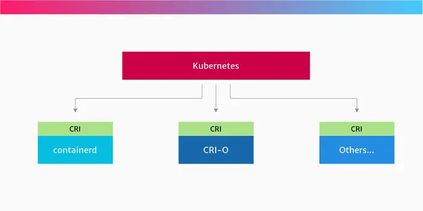

# [The differences between Docker, containerd, CRI-O and runc](https://www.tutorialworks.com/difference-docker-containerd-runc-crio-oci/)
container는 library, runtime, api 등 복잡한 스택을 사용해 실행된다.

## How we got here
container는 docker라는 이름과 일치하는 개념이 아니다. 다른 도구를 사용해 container를 실행할 수 있다. docker를 사용해 container를 실행할 수도 있으며 docker가 아닌 다른 여러 도구를 사용할 수도 있다. docker는 많은 옵션 중 하나일 뿐이며 Docker라는 회사에서 container 생테계에서 docker라는 엄청난 도구를 만들어냈을 뿐이다.

해당 글에서는 container 주변의 생톄게를 살펴봄으로써 각각의 역할에 대해 살펴본다.

## A bird’s eye view
container 생테계는 많은 흥미로운 기술, 전문 용어, 회사들이 혼재한다.

다행스럽게도 회사들은 몇 가지 표준을 정의했다. 표준은 생테계를 더욱 상호 운용성 있게 만드는 데 도움이 된다. 즉, 서로 다른 플랫폼과 운영 체제에서 소프트웨어를 실행할 수 있으며, 단일 회사나 프로젝트에 덜 의존성을 갖게 된다.

container와 관련된 큰 두개의 표준이 있다.
- `Container Runtime Interface(CRI)`: k8s 환경에서 다양한 container runtime을 사용하기 위한 API 표준
    - kubernetes의 container runtime과 kubelet 간 통신을 표준화하기 위한 API 인터페이스
    - high-level runtime이 구현한다. high-level runtime은 low-level runtime에서 직접적으로 격리하는(컨테이너를 생성하는) 사항들을 '관리(supervision)'한다. 쉽게 말해 high-level runtime은 low-level runtime에 대한 configuration을 진행하고 실제 이에 대한 실행은 low-level runtime에서 수행한다.
    - 목표
        - kubernetes가 다양한 container runtime을 쉽게 통합할 수 있도록 표준 인터페이스(API)를 제공
        - kubernetes에서 container runtime을 교체하거나 추가할 때 코드 변경을 최소화
    - 구성 요소
        - gRPC 기반 API(CRI는 gRPC 기반으로 설계되어 kubernetes와 container runtime 간 효율적인 통신이 가능)
        - 두 가지 주요 API: RuntimeService API(컨테이너 생성, 시작, 정지 등의 작업 처리), ImageService API(container image 다운로드, 캐싱, 삭제 처리)
    - 예시
        - Docker를 사용하던 kubernetes가 CRI-O, containerd 등으로 전환할 수 있게 지원
        - CRI-O와 containerd는 CRI를 준수하는 runtime으로 kubernetes와 쉽게 통합 가능
- `Open Container Initiative(OCI)`: container에 대한 표준. image format, runtime, distribution과 관련 있다.
    - OCI는 container runtime, image의 표준화를 목표로 하는 오픈 표준화 프로젝트
    - low-level runtime이 구현한다. low-level container runtime은 컨테이너를 직접 실행하는 역할을 담당한다. low-level container runtime에서 '저수준'이러는 이름을 붙인 이유는 오직 컨테이너를 실행시키고 실행 중인 컨테이너만을 관리하기 때문이다.
    - 컨테이너는 linux namespace와 cgroup(control group)을 사용하여 구현되는데, namespace는 각 컨테이너에 파일 시스템이나 네트워크와 같은 시스템 resource를 격리, 가상화하며 cgroup은 각 컨테이너가 사용할 CPU, 메모리, 네트워크, I/O, 디바이스 등의 자원을 제어한다. low-Level container runtime은 이러한 namespace와 cgroup을 설정하고 namespace, cgroup 내에서 명령을 실행한다. cgroup과 namespace는 모두 kernel의 기능이며 이를 다루는 방법은 리눅스 배포판과 kernel 버전마다 다르다.
    - 목표
        - container의 호환성과 이식성을 높이기 위해 image, runtime 표준을 정의(어떻게 컨테이너 이미지를 만들고 구성할 것인가(Image Specification)와 어떻게 그 이미지를 실행할 것인가(Runtime Specification)와 어떻게 이미지를 전송할 것인가(Distribution Specification))
        - container 기술이 공급업체에 종속되지 않도록 보장
    - 구성 요소
        - Image Specification (image-spec):
            - container image의 형식과 배포 방법을 정의(Docker image와 호환성을 유지하며, image의 layer 구조와 메타데이터를 표준화)
            - 개발자가 Dockerfile 등으로 애플리케이션을 빌드하면, 클라이언트는 OCI image-spec에 따라 image 매니페스트, 설정 파일, 레이어들을 생성
        - Distribution Specification (distribution-spec):
            - container registry와 클라이언트 간의 통신을 위한 표준 API를 정의한다.
            - docker push 명령을 실행하면, 클라이언트는 OCI distribution-spec에 정의된 API를 통해 레지스트리에 레이어(blobs)와 매니페스트를 업로드
            - k8s 클러스터 같은 환경에서 image를 사용하기 위해 containerd 같은 runtime이 OCI distribution-spec API를 사용하여 레지스트리로부터 매니페스트와 필요한 레이어들을 다운로드
        - Runtime Specification (runtime-spec)
            - container 실행 환경(예: runc)에서 사용하는 표준을 정의(컨테이너의 생명주기와 실행 환경을 어떻게 구성하고 관리할 것인지에 대한 표준을 정의)
            - image를 모두 내려받으면, containerd는 image-spec에 따라 파일시스템 번들(config.json, rootfs)을 구성하고, OCI runtime-spec을 따르는 runc를 호출하여 컨테이너를 실행
    - 예시
        - Docker, Podman, CRI-O 등에서 OCI 표준을 기반으로 container를 빌드 및 실행
        - runc는 OCI runtime-spec을 구현한 대표적인 runtime

아래에서는 Docker, Kubernetes, CRI, OCI, containerd, runc가 생테계에서 어떤 역할을 수행하는지 알아본다.

두 표준은 별개로 존재하는 것이 아니라, CRI가 OCI를 기반으로 동작한다.
- Kubelet → (CRI API) → [high-level Runtime] → (OCI 표준) → [low-level Runtime] → Linux Kernel
    1. Kubelet이 CRI API를 통해 "파드(Pod)를 실행해 줘"라고 요청한다.
    2. high-level Runtime (예: containerd, CRI-O)이 이 요청을 받는다. 이들은 CRI 구현체이다.
    3. high-level Runtime은 이미지 다운로드, 네트워크 설정 등을 처리한 후, OCI 표준에 맞는 컨테이너 설정 파일(config.json)과 파일 시스템을 만든다.
    4. 마지막으로 low-level Runtime (예: runc)을 호출하여 OCI 표준에 따라 실제 컨테이너 프로세스를 실행한다.

## Docker
docker는 container와 관련된 가장 인기있는 개발 도구다. 그래서 많은 사람들이 docker와 container를 같은 것으로 생각한다.

docker는 container를 사용하기 위한 아주 편리한 도구다. 현재는 Docker Engine으로 불리며 두 가지 버전이 있다.
- Docker Desktop for your developer workstation, available for Windows, Mac and Linux
- Docker Engine for your server, available for Linux.

### How the Docker stack works
Docker Engine은 개발자나 시스템 관리자가 container를 쉽게 만들고 운영할 수 있는 수 많은 도구를 제공한다. Docker Engine은 dockerd, docker cli, docker api를 제공한다. dockerd는 내부적으로 containerd, runc 등 container를 제어하기 위한 여러 도구를 포함하고 있다.

docker cli는 docker api를 사용해 dockerd에게 명령어를 요청한다. 그리고 dockerd 내부적으로는 container 제어를 위한 여러 도구를 사용한다. 아래는 이에 대한 그림을 나타낸다.

### What are the lower-level tools in the Docker stack?
아래는 docker 명령어가 container 실행을 위해 사용하는 도구다.
- low-level container runtime([runc](https://github.com/opencontainers/runc)): low-level container runtime이다. 리눅스의 기본 기능을 사용해 container를 생성하고 실행한다. OCI 표준을 따르며 container를 생성하기 위한 go library인 [libcontainer](https://pkg.go.dev/github.com/opencontainers/runc/libcontainer)가 포함되어 있다.
- high-level container runtime([containerd](https://containerd.io/)): low-level 위에 존재하는 container runtime으로 image 전송, 저장, 네트워킹과 같은 기능을 제공한다. OCI 표준을 따른다.
- docker daemon([dockerd](https://docs.docker.com/reference/cli/dockerd/)): CRI가 아닌 docker를 위한 API를 제공하고 container runtime과 상호 작용하는 daemon 프로세스
- docker CLI 명령어([docker-cli](https://github.com/docker/cli)): container를 제어하기 위한 여러 복잡한 도구에 대한 이해 없이 사용자가 쉽게 container를 제어할 수 있는 명령어다.

### Does Kubernetes use Docker?
kubernetes는 이전에 Docker Engine을 사용해 container를 사용했다.

하지만 시간이 지나면서 kubernetes는 container에 구애받지 않는 플랫폼으로 발전했다. 그리고 kubernetes는 CRI를 만들었으며 이를 통해 다양한 container runtime을 지원할 수 있게 됐다.

kubernetes보다 오래된 프로젝트인 docker는 CRI를 구현하지 않았다. 그래서 kubernetes 프로젝트에서는 이를 위한 dockerhim이라는 구성요소를 포함하고 있었으며 이를 통해 docker runtime으로 container를 실행할 수 있었다.

#### Death of the shim
하지만 kubernetes v1.24부터 dockershim 구성요소는 완전히 제거됐으며 kubernetes는 공식적으로 docker를 container runtime으로 지원하지 않는다. 대신 CRI를 구현한 다른 container runtime을 사용해야 한다.

kubernetes가 docker 형식의 container를 실행할 수 없는 것은 아니다. containerd, CRI-O 모두 kubernetes에서 Docker-formatted, OCI-formatted image를 실행할 수 있다.

초기 kubernetes에서는 docker를 container runtime으로 사용하기 위해 dockershim과 같은 도구를 kubelet 소스 코드 내부에 하드 코딩으로 통합되어 구현되었는데, docker engine의 인터페이스 변경에 맞게 계속해서 수정하여 사용했다. 이렇게 통합된 프로세스는 kubelet에 대한 깊은 이해가 필요했고 kubernetes 커뮤니티에 상당한 유지보수 오버헤드를 발생시켰으며, kubernetes는 계속해서 다양한 container runtime마다 kubelet을 수정하여 kubelet과 통합하기에는 무리가 있었기 때문에, kubernetes에서는 kubelet의 수정없이 여러 container runtime을 지원하기 위해 kubelet과 container runtime간의 통신을 위한 주요 gRPC 프로토콜을 정의하였는데 이것이 CRI이다. container runtime들은 해당 CRI의 스펙에 맞추어 CRI 컴포넌트를 구현하여 쉽게 kubelet과 호환될 수 있었으며, containerd, CRI-O와 같은 container runtime들은 CRI 규격에 맞게 인터페이스를 구현하고 있다. kubelet은 CRI에 출실한 인터페이스를 통해 container runtime들과 통신하여 container를 관리하는 동작을 수행할 수 있다. CRI를 간단히 요약하면 클러스터 컴포넌트를 다시 컴파일하지 않아도 kubelet이 다양한 container runtime을 사용할 수 있도록 하는 플러그인 인터페이스 정의이다.

### What about Docker Desktop?

## The standards and APIs: OCI and CRI
앞에서 표준을 통해 서로 다른 플랫폼에서 container를 쉽게 실행할 수 있다고 했다. 이러한 표준들은 정확하게 무엇일까?

### Open Container Initiative (OCI) specifications
[OCI](https://opencontainers.org/)는 container 생테계를 위한 몇 가지 표준을 만들었다. 2015년에 Docker와 다른 회사들에 의해 설립됐다.

OCI는 많은 회사의 지원을 받고 있으며 container image format, container 실행 방법에 대한 표준을 정의한다.

OCI의 배경이 되는 아이디어는 `container가 무엇인지, container가 무엇을 할 수 있어야 하는지`를 표준화한 것이다.

### Kubernetes Container Runtime Interface
또 다른 표준은 CRI다. 이는 kubernetes 프로젝트에 의해 만들어진 API다.

CRI는 kubernetes가 container를 만들고 관리하는 다양한 runtime을 제어하는 데 사용하는 인터페이스다.

kubernetes는 사용자가 어떤 container runtime을 사용하는지 신경 쓰지 않는다. 단지 pod를 위한 container를 만들고 종료하는 등의 명령어를 전송할 수 있기만 하면 된다. 그리고 이를 위한 것이 CRI다. CRI는 현재 또는 미래에 존재할 수 있는 모든 종류의 container runtime에 대한 추상화다. 따라서 CRI는 kubernetes가 다른 container runtime을 더 쉽게 사용할 수 있도록 만들어준다.

kubernetes 프로젝트가 개별적으로 각 runtime에 대한 지원을 추가해야 하는 대신 CRI API는 kubernetes가 어떤 런타임과 상호 작용하는지 설명한다. 주어진 container runtime이 CRI API를 구현한다면 runtime은 원하는 대로 container를 생성하고 실행할 수 있다.

아래는 CRI가 container 생태계에 어떻게 적합한지에 대한 간단한 시각화다.

따라서 kubernetes에서 container 실행을 위해 containerd, CRI-O 모두 사용할 수 있다.

### How to find out your container runtime in Kubernetes
kubernetes에서 각 node에서 실행되는 kubelet은 container 관련 명령어를 container runtime와 상호작용하는 역할을 수행한다. kubelet의 `--container-runtime`, `--container-runtime-endpoint` runtime flag를 사용해 kubelet이 사용할 container runtime을 설정할 수 있다.

## containerd and CRI-O
앞에서 Docker Engine의 수 많은 하위 도구를 확인했다. 여기서는 각 하위 도구들에 대해 살펴본다.

첫 번째 high-level runtime은 containerd(Docker에서 개발), CRI-O(Red Hat에서 개발)이 있다.

### containerd
containerd는 docker에서 나온 high-level의 container runtime이다. CRI 표준을 구현한다. registry에서 image를 pull하고 lower-level runtime에 역할을 넘겨준다. low-level runtime은 리눅스 커널의 기능을 사용해 container라고 부르는 프로세스를 생성한다.

containerd는 원래 docker 프로젝트의 일부에서 탄생했다. 그런데 왜 분리됐을까? 아마도 docker의 모듈화를 위해서이며, 이를 통해 docker가 더 많은 장소에서 실행될 수 있었다.

내부적으로 Docker Engine은 containerd를 사용한다. docker를 설치할 때 containerd도 설치한다.

containerd는 cri 플러그인을 통해 kubernetes CRI를 구현하기 때문에 kubernetes container runtime으로 사용될 수 있다.

### CRI-O
CRI-O는 kubernetes CRI를 구현하는 또 다른 high-level container runtime이다. containerd와 동일하게 registry에서 image를 pull하고 lower-level runtime에 역할을 넘겨준다. low-level runtime은 리눅스 커널의 기능을 사용해 container라고 부르는 프로세스를 생성한다.

CRI-O는 또 다른 container runtime으로 Red Hat, IBM, Intel, SUSE에 의해 탄생했다.

CRI-O는 kubernetes runtime으로 개발됐으며 containerd와 마찬가지로 container 시작, 삭제와 같은 기능을 제공한다.

## runc and other low-level runtimes
runc는 OCI-호환 container runtime이다. OCI 표준을 구현했으며 container 프로세스를 실행한다.

runc는 “reference implementation of OCI”라고도 불린다.

> **Note**:  
> reference implementation는 표준의 모든 요구 사항을 구현한 소프트웨어를 의미한다. 일반적으로 처음 개발된 소프트웨어를 의미한다. OCI의 경우 runc는 OCI 호환 runtime에 예상되는 모든 기능을 제공한다.

runc는 리눅스의 namespace, cgroup과 같은 기능과 상호 작용함으로써 container를 위항 low-level 기능을 제공한다. 이를 통해 container 프로세스를 만들고 실행한다.

### Other low-level runtimes
runc가 유일한 low-level container runtime은 아니다. OCI를 구현한 다른 container runtime도 존재한다.
- crun: a container runtime written in C (by contrast, runc is written in Go.)
- firecracker-containerd: from AWS, which implements the OCI specification as individual lightweight VMs (and it is also the same technology which powers AWS Lambda)
- gVisor: from Google, which creates containers that have their own kernel. It implements OCI in its runtime called runsc.